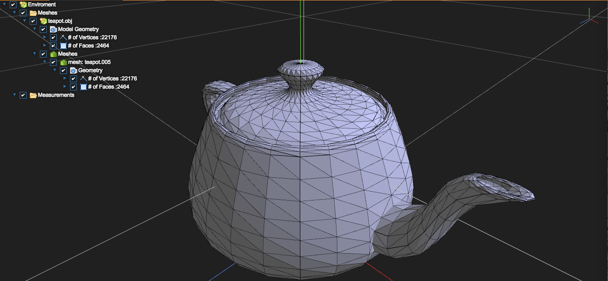
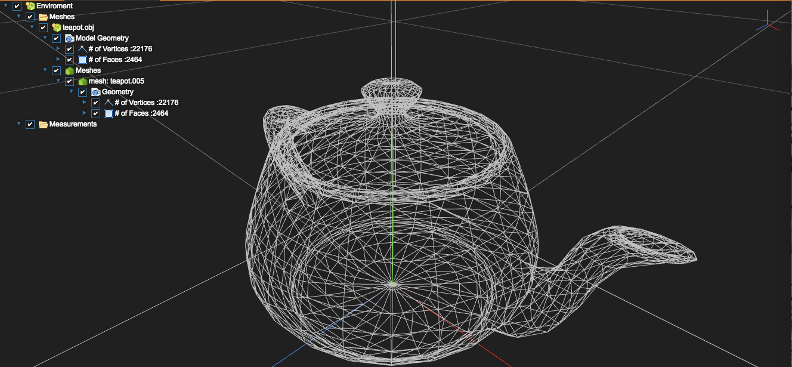
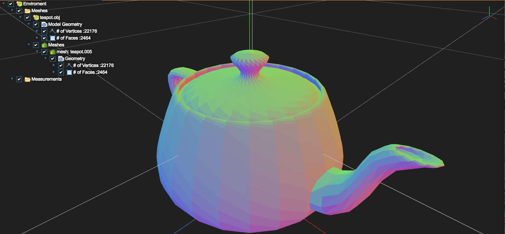
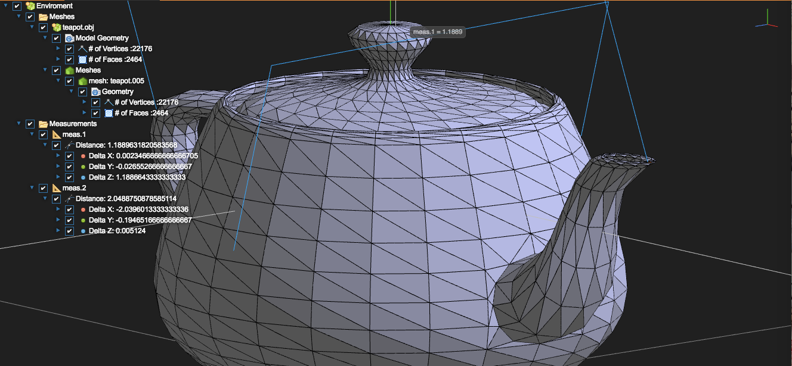

# Iris Web Viewer

### Status

Iris Web Viewer is an open source experimental online model viewer. It allows you to view 3D Exchange format files through a web browser with out the need for larger packages to be installed on a computer. It runs off of Javascript and WebGL is available at [Iris Web Viewer](https://VirtexEdgeDesign.github.io/Iris-Web-Viewer/) as well as through a Chrome Web Extension:

## License & Disclaimer

Iris is released under the [MIT License](https://github.com/VirtexEdgeDesign/Iris-Web-Viewer/blob/master/License.md).

Note though, that Iris is currently both experimental and in Beta, and therefore naturally has some bugs in it. It's not a perfect system and is therefore only useful for general views and for working out rough ideas. It comes with no warrenty what so ever (refer to license). Any models should be viewed and infomation verfied through a secondary programand before any designs are finalised. That said it's meant for informal viewing of 3D files in non-critical applciations as well as it's open source, so feel free to commit and add to it as you see fit!

# Features

## Import

Iris can import any of the following model formats. If there's one you don't see then feel free to request it in the 'Issues'.

- stl (both ASCII and Binary)
- obj (material files not supported yet)

## Export

Iris can can also export to stl files for use in 3D Printing. We currently only support ASCII stl files.

## Tree View Breakdown

The Iris Environment has a treeview overlayed on the screen, allowing you to view statistics of each imported models as well as be able to hide and show groups/sub meshes of each model. Other info, such as measurements, are added to the treeview, allowing you to see broken down information (such as the measured distance in each coordinate axis).

## Multiple Shader Outputs

Solid, Wireframe and Normal shader options are avaiable. Solid gives a basic grey view to the model, Wireframe shows an entire wireframe skelton of the edges of the models and surface triangles. and _Normal_ shows the angle at which the surface is relative to the Global X, Y and Z axis'.

### Solid

The Solid View of the 'Utah teapot'.

### Wireframe

The Wireframe View of the 'Utah teapot'.

### Normal

The Normal View of the 'Utah teapot'.

## Surface Measurement

Iris allows you to measure the distance between different triangular faces of the imported model. This allows you to get a rough idea of distances in your model. Note: that no exact units are defined in Iris (i.e. mm, inches, etc...) and the measurements given are in terms of Face center positions calcuated from Face Vertices.

